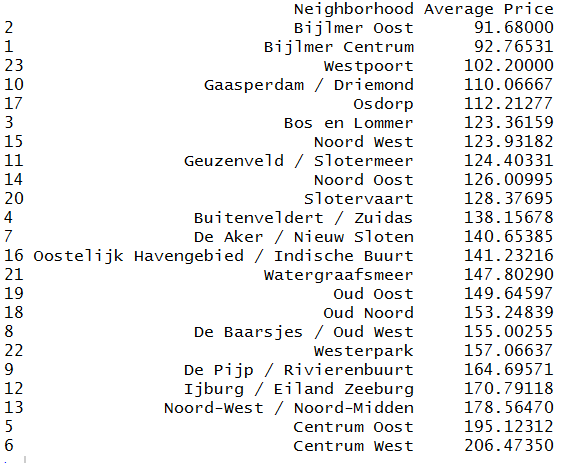

# airbnb
The goal of airbnb is to provide travelers with information 
regarding the housing options under different criteria in the city corresponding to the dataset on
which the package is being used on.

# installation
You can install airbnb from github with:

``` {r airbnb_installation}
# install.packages("devtools")
devtools::install_github("FernandaPalacios/airbnb")
```

# example 
## neighborhood_average

``` {r airbnb_example}
# load dataset
amsterdam <- read.csv("airbnb_amsterdam.csv")
# list out airbnb's average prices per neighbourhood in amsterdam
neighborhood_average(amsterdam)
```


## airbnb_listing

``` {r second_example}
# list out airbnb's housing options in the given price range and number of bedroooms 
airbnb_listing(amsterdam, 2, 70)
```

